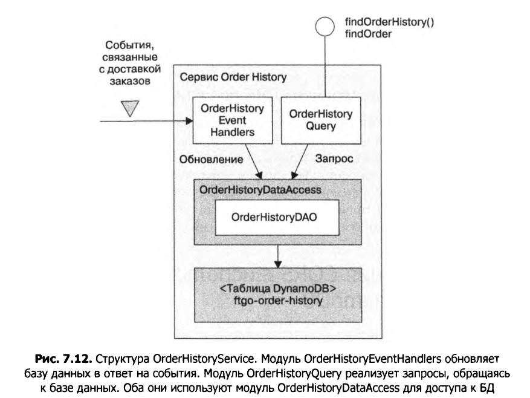

# CQRS-представление для Order History

CQRS-представление для операции `findOrderHistory()` потребляет события из нескольких сервисов, поэтому оно реализуется в виде отдельного сервиса **Order View**.  

Этот сервис имеет API, которое реализует две операции:  
- `findOrderHistory()`  
- `findOrder()`  

Хотя последнюю можно реализовать с помощью объединения API, в этом представлении она предоставляется фактически «даром».  

Структура сервиса **Order History** показана на рис. 7.12. Он состоит из набора модулей, каждый из которых имеет определённую обязанность, что упрощает разработку и тестирование.

## Обязанности модулей

- **OrderHistoryEventHandlers**  
  Подписывается на события, публикуемые различными сервисами, и вызывает `OrderHistoryDAO`.

- **OrderHistoryQuery (API)**  
  Реализует конечные точки REST, описанные ранее.

- **OrderHistoryDataAccess**  
  Содержит объект `OrderHistoryDAO`, который определяет методы для обновления и обращения к таблице **MongoDB `ftgo-order-history`**, а также его вспомогательные классы.

- **Таблица MongoDB `ftgo-order-history`**  
  Хранит заказы.

